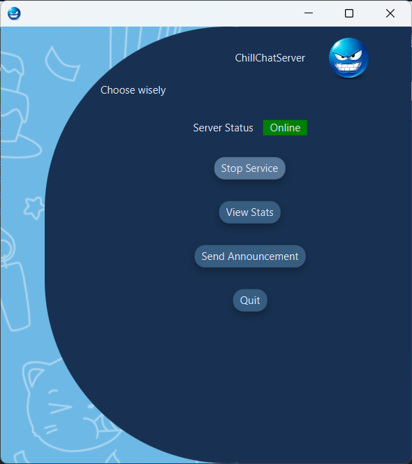
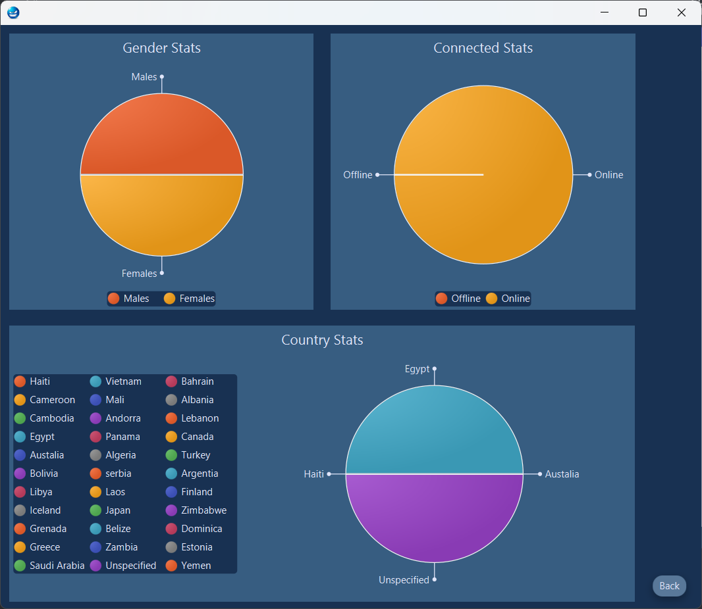
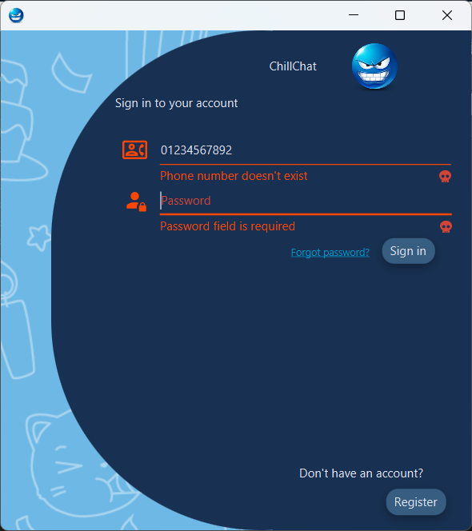
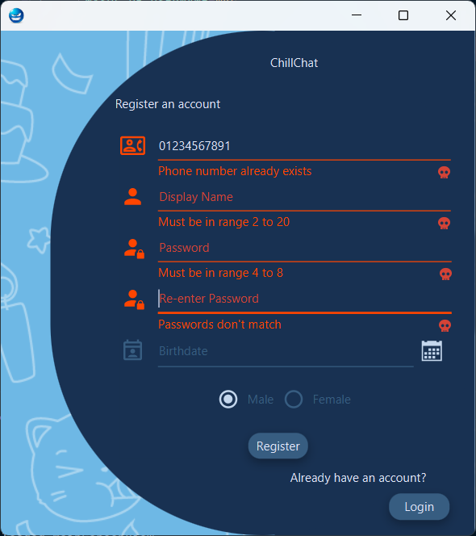
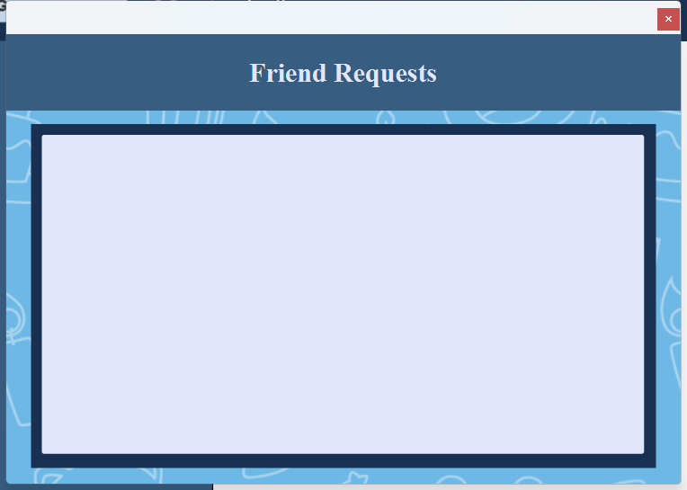

# ITI_ChatApp 

A Chat App as a project for [ITI](iti.gov.eg/), That supports networking, sending/receiving any type of messages (text, photos, videos, and others), chat export, customizable chat bot support, and an admin side with a dashboard to control the server, view user's statistics, and send global notification messages to all users

## Methodologies

Java, MySql, RMI, Sockets, UDP/TCP, AIML, and FXML

## Credits

We started this from scratch and made it into the fully functional Networking Chat App it is now.

Team members:
- [Salma ElKady  (Id: 1)](https://github.com/Salma-Elkady97)
- [Mohammed Hassan  (Id: 15)](https://github.com/mhbughdadi)
- [Maha Mekdad  (Id: 16)](https://github.com/MahaMekdad)
- [MKSherbini  (Id: 666)](https://github.com/MKSherbini)

## Run instructions
- install mysql or use `docker-compose up` with the provided docker-compose file
- create the database using the provided `db.sql` file
- run each of the server/client applications using `mvn clean javafx:run`

## Target Platform

Supports all systems that support java jar.

## Release

Released in jars for cross-platform use.

## Website ScreenShots

